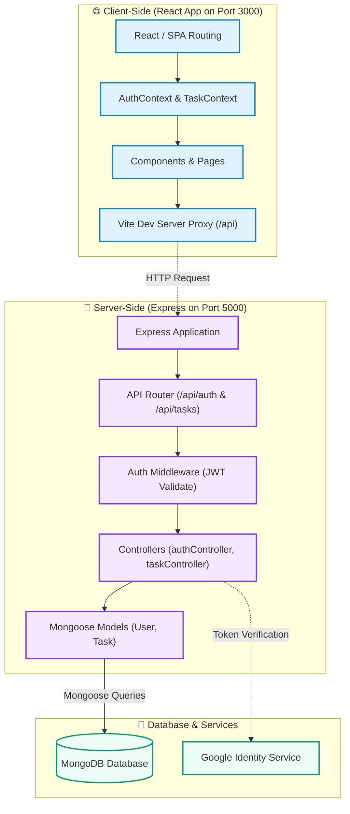

# 🌌 QuantumTask: Premium Full-Stack Task Management Hub

QuantumTask is a modern, high-performance, and feature-rich task management dashboard built using the MERN Stack. It features real-time analytics, user authentication (with Google OAuth integration), profile personalization, and responsive design.

---

## 🚀 Key Features

* **🔐 Multi-Method Authentication:** Secure JWT-based registration/login and Google OAuth 2.0 integration.
* **📊 Live Analytics Dashboard:** Real-time metrics, completion rates, and priority distribution graphs.
* **📋 Task CRUD & Kanban Interface:** Organise tasks by status (To Do, In Progress, Completed) and priority (High, Medium, Low).
* **👤 User Profile Management:** Customise user profiles with avatar uploads, bio updates, and full detail controls.
* **🎨 Premium Aesthetic:** Modern styling with soft gradients, glassmorphism, responsive grid layouts, and micro-interactions.
* **📦 Workspace Orchestration:** Integrated monorepo layout powered by npm Workspaces for seamless full-stack development.

---

## 🛠 Tech Stack

### Frontend
* **Core:** React 18, React Router DOM v6
* **Build Tool:** Vite (for fast hot module reloading)
* **Styling:** Custom Modern Vanilla CSS (featuring HSL variables, fluid transitions, and responsive grid layouts)
* **Icons:** Lucide React

### Backend
* **Runtime & Framework:** Node.js, Express.js (v5)
* **Authentication:** JSON Web Tokens (JWT), `bcryptjs`, and Google Auth Library
* **Database Object Modeling:** Mongoose (for MongoDB integration)

### Database
* **Database:** MongoDB (Local instance or Cloud Atlas)

---

## 📂 Repository Structure

The project is organised as an **npm Workspace** monorepo:

```text
MERN-Project/
├── client/                 # React frontend application (Vite-based)
│   ├── src/
│   │   ├── components/     # Reusable layout and UI elements
│   │   ├── context/        # React context providers (AuthContext, TaskContext)
│   │   ├── pages/          # Application views (Dashboard, Tasks, Analytics, Profile, Auth)
│   │   ├── App.jsx         # Root component & Route definitions
│   │   └── index.css       # Global stylesheet & design tokens
│   ├── vite.config.js      # Vite dev settings & API proxying
│   └── package.json        
│
├── server/                 # Express backend application
│   ├── controllers/        # Business logic handlers (auth, task, analytics)
│   ├── middleware/         # Auth verification middleware (JWT verification)
│   ├── models/             # Mongoose schemas (User, Task)
│   ├── routes/             # REST API endpoint declarations
│   ├── app.js              # Application entry point & middleware stack
│   ├── db.js               # Database connection logic
│   └── package.json
│
├── package.json            # Root workspace config & scripts
└── README.md               # Documentation
```

---

## 📐 Architecture & Data Flow

Below is the high-level architecture diagram detailing component interactions and communication flows in QuantumTask:



---

## ⚙️ Quick Start & Installation

### 1. Prerequisites
Ensure you have the following installed on your machine:
* **Node.js** (v18.x or higher)
* **npm** (v9.x or higher)
* **MongoDB** (Local Community Edition running on port 27017 or a MongoDB Atlas URI)

### 2. Clone and Setup
Clone the repository and install all dependencies for both frontend and backend using npm Workspaces:
```bash
git clone https://github.com/badivana/MERN-Project.git
cd MERN-Project
npm install
```

### 3. Environment Variables
Create a `.env` file in the [server/](file:///d:/MERN-Project/server) directory:
```env
PORT=5000
MONGODB_URI=mongodb://127.0.0.1:27017/mern_pro
JWT_SECRET=your_super_secure_jwt_secret_key
GOOGLE_CLIENT_ID=your-google-client-id.apps.googleusercontent.com
```

### 4. Running the Application
From the **root** folder, spin up the entire application concurrently (both backend API and frontend dev server) using:
```bash
npm run dev
```

* **Frontend:** `http://localhost:3000` (Vite dev server)
* **Backend:** `http://localhost:5000` (Express server)

---

## 🔌 API Endpoints Reference

### 🔐 Authentication (`/api/auth`)
| Method | Endpoint | Description | Auth Required |
| :--- | :--- | :--- | :--- |
| **POST** | `/api/auth/signup` | Registers a new user | No |
| **POST** | `/api/auth/login` | Log in with email & password | No |
| **POST** | `/api/auth/google-login` | Authenticate via Google OAuth token | No |
| **GET** | `/api/auth/google-client-id` | Retrieve Google OAuth Client ID | No |
| **GET** | `/api/auth/me` | Retrieve authenticated user profile | **Yes (JWT)** |
| **PUT** | `/api/auth/profile` | Update user profile details | **Yes (JWT)** |

### 📋 Tasks (`/api/tasks`)
| Method | Endpoint | Description | Auth Required |
| :--- | :--- | :--- | :--- |
| **GET** | `/api/tasks` | Get all tasks for the logged-in user | **Yes (JWT)** |
| **POST** | `/api/tasks` | Create a new task | **Yes (JWT)** |
| **PUT** | `/api/tasks/:id` | Update an existing task | **Yes (JWT)** |
| **DELETE** | `/api/tasks/:id` | Delete a task | **Yes (JWT)** |
| **GET** | `/api/tasks/analytics` | Get analytics summaries & stats | **Yes (JWT)** |

---

## 🎨 Styling & Design Tokens
QuantumTask uses a custom fluid design system defined inside [client/src/index.css](file:///d:/MERN-Project/client/src/index.css) using CSS variables:
* **Backgrounds & Layers:** Glassmorphism overlay states, card elevation levels, and variable opacity controls.
* **Colors:** Accent-driven palette (Violet/Lavender accents, dark/neutral mode variations).
* **Typography:** Inter/Outfit font fallback stacks.

---

## 🤝 Contributing
1. Fork the project.
2. Create your Feature Branch (`git checkout -b feature/AmazingFeature`).
3. Commit your changes (`git commit -m 'Add some AmazingFeature'`).
4. Push to the Branch (`git push origin feature/AmazingFeature`).
5. Open a Pull Request.

---

## 📄 License
This project is licensed under the MIT License - see the [LICENSE](file:///d:/MERN-Project/LICENSE) file for details.
